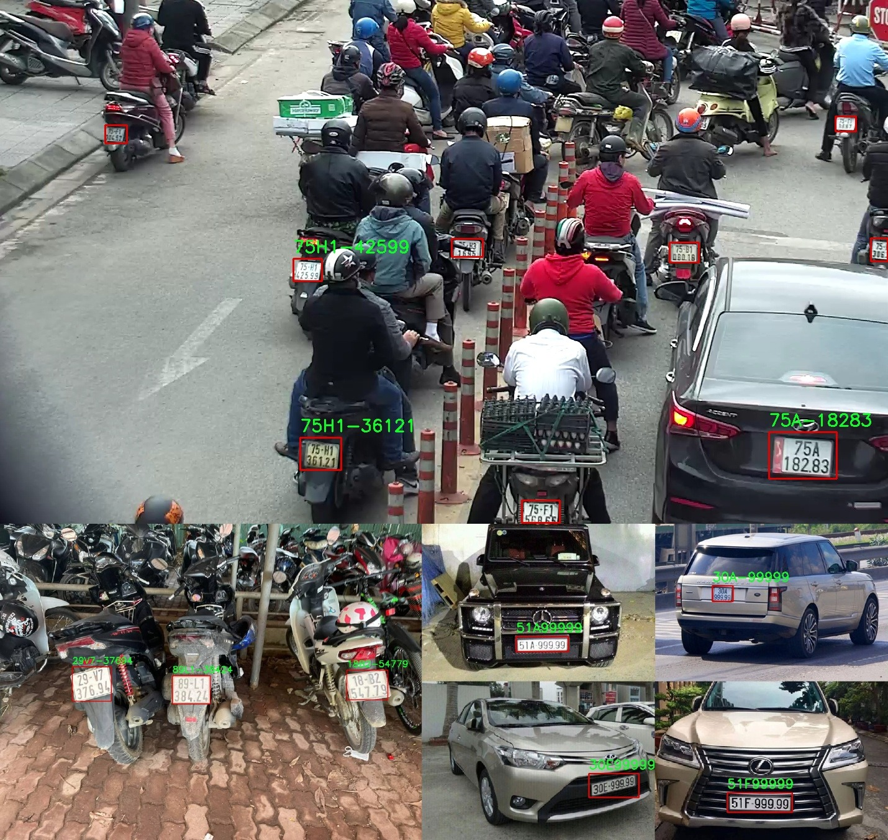

## Installation

```bash
  # install dependencies using pip 
  pip install -r ./requirement.txt
```
- **tải yolov5 (old version) link:** [yolov5 - google drive](https://drive.google.com/file/d/1g1u7M4NmWDsMGOppHocgBKjbwtDA-uIu/view?usp=sharing)

- Copy yolov5 vào dự án project

## Run License Plate Recognition

```bash
  # run inference on webcam (15-20fps if there is 1 license plate in scene)
  python webcam.py 

  # run inference on image
  python lp_image.py -i test_image/3.jpg

  # run LP_recognition.ipynb if you want to know how model work in each step
```

## Result



## Vietnamese Plate Dataset

This repo uses 2 sets of data for 2 stage of license plate recognition problem:

- [License Plate Detection Dataset](https://drive.google.com/file/d/1xchPXf7a1r466ngow_W_9bittRqQEf_T/view?usp=sharing)
- [Character Detection Dataset](https://drive.google.com/file/d/1bPux9J0e1mz-_Jssx4XX1-wPGamaS8mI/view?usp=sharing)

Thanks [Mì Ai](https://www.miai.vn/thu-vien-mi-ai/) and [winter2897](https://github.com/winter2897/Real-time-Auto-License-Plate-Recognition-with-Jetson-Nano/blob/main/doc/dataset.md) for sharing a part in this dataset.

## Training

**Training code for Yolov5:**

Use code in ./training folder
```bash
  training/Plate_detection.ipynb     #for LP_Detection
  training/Letter_detection.ipynb    #for Letter_detection
```
